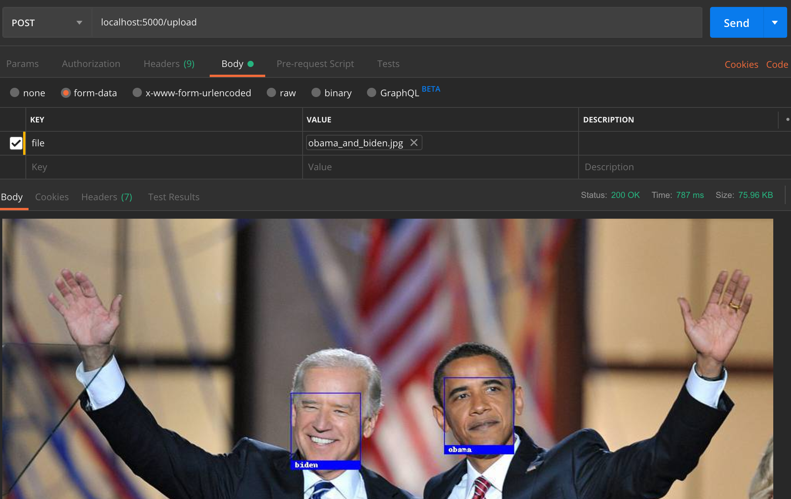

# Face Recognition Demo App

> Combining the popular [face_recognition](https://github.com/ageitgey/face_recognition) library with a simple flask backend that can receive images and respond with the labeled ones, without saving them locally.

## 💾 Install

```sh
pip3 install -r requirements.txt
```

## 🚀 Usage

* To run the server with the sample model
```sh
python3 api.py
```

* To train your own KNN classifier with your dataset, place your images according to the structure below:
```sh
images/train/
        ├── <person1_name>/
        │   ├── <someimage1>.jpeg
        │   ├── <someimage2>.jpeg
        │   ├── ...
        ├── <person2_name>/
        │   ├── <someimage1>.jpeg
        │   └── <someimage2>.jpeg
        └── ...
```
```sh
python3 train.py
```
The trained model will be placed in the root folder, named as "trained_knn_model.clf"

* Send POST requests to the /upload endpoint with a file on them as form-data 


## Sample results of using it as the backend of a web page


